# Class hierarchies

The inheritance trees across `src/router/`, `src/training/` and
`src/evaluation/`, plus the composition edges that hold them together.
Everything model-side is a `torch.nn.Module`; the routing and agentic layers
are plain classes over an abstract base.

The three packages enforce one hard boundary: **`router` (serving) never
imports `training` or `evaluation`.** `training` may import `router`;
`evaluation` may import both. Concretely: `NIRTModel` / `BaselineNIRT` (model
definitions), checkpoint loading, and label-free inference live in `router`;
fitting (`fit`, `fit_mlp_router`) lives in `training`; anything that needs
ground truth (`evaluate_split`, `routing_evaluation`, oracle labels) lives in
`evaluation`. Namespaces below are annotated with their top-level package
where it isn't `router`.

```mermaid
classDiagram
    direction TB

    class nnModule["torch.nn.Module"]
    class TorchDataset["torch.utils.data.Dataset"]
    class ABC["abc.ABC"]
    class RuntimeError

    namespace nirt_models {
        class NIRTModel {
            +str orientation = "query_latent"
            +Module query_head
            +from_config(cfg) NIRTModel
            +latent_query(e_q) theta_q
            +forward(e_q, model_ref) Tensor
        }
        class IRTRouterModel {
            +str orientation = "model_latent"
            +from_config(cfg) IRTRouterModel
            +forward(e_q, model_ref) Tensor
        }
        class BaselineNIRT["BaselineNIRT (training)"] {
            +str orientation = "model_latent"
            +str arch = "baseline"
            +from_config(cfg) BaselineNIRT
            +forward(e_q, model_ref, r_q, neighbor_mean) Output
        }
    }

    namespace response_heads_training {
        class ResponseHead["ResponseHead (training)"] {
            <<abstract>>
            +str key
            +str target
            +forward(z, features) ResponseOutput
            +nll(y, out) Tensor
            +loss(y, out) Tensor
            +mean(out) Tensor
            +variance(out) Tensor
            +interval(out, level) tuple
            +lower_bound(out, level) Tensor
            +as_probability(out) Tensor
            +boundary_probs(out)
        }
        class BernoulliResponseHead {
            +str key = "bernoulli"
            +str target = "binary"
        }
        class NormalResponseHead {
            +str key = "normal"
            +Module f_sigma
        }
        class BetaResponseHead {
            +str key = "beta"
            +Module f_kappa
        }
        class ZOIBResponseHead {
            +str key = "zoib"
            +Module f_pi
            +Module f_kappa
        }
    }

    namespace nn_components {
        class WarmupBlender {
            +forward(e_q, neighbor_mean) e_q_blended
        }
        class DiscriminationHead {
            +forward(e_q, r_q) tuple~a_q, gate~
        }
        class DifficultyHead {
            +forward(e_q) b_q
        }
        class InteractionLayer {
            +forward(a_q, theta_m, b_q, r_q) tuple~logit, base_irt~
        }
        class LengthHead {
            +forward(e_q) length_pred
        }
    }

    namespace data {
        class NIRTDataset {
            +int query_dim
            +int model_dim
            +ndarray targets
            +__getitem__(i) dict
            +dataloader(batch_size) DataLoader
            +gather() dict
            +from_config(cfg) NIRTDataset
        }
        class EmbeddingStore {
            +list ids
            +ndarray matrix
            +row_of(id) int
            +load(dir) EmbeddingStore
        }
        class IncompleteEmbeddingStore
    }

    namespace routing_strategies {
        class Router {
            <<abstract>>
            +str kind
            +bool can_route_text
            +list model_ids
            +predict_scores(query_ids) DataFrame
            +predict_scores_text(texts) DataFrame
            +route(query_ids, lam) RoutingResult
            +route_text(texts, lam) RoutingResult
        }
        class MatrixRouter {
            +str kind = "matrix"
        }
        class NIRTRouter {
            +str kind = "nirt"
            +bool can_route_text = true
            +from_run(run_name) NIRTRouter
        }
        class KNNRouter {
            +str kind = "knn"
            +bool can_route_text = true
        }
        class MLPRouter {
            +str kind = "mlp"
        }
        class RandomRouter {
            +str kind = "random"
        }
    }

    namespace agentic {
        class LLMClient {
            <<abstract>>
            +str model_id
            +invoke(prompt) LLMResponse
        }
        class EchoClient
        class CallableClient
        class LangChainClient
        class AgenticRouter {
            +route_decision(prompt) RoutingResult
            +triage_prompt(prompt) TriageDecision
            +run(prompt) AgenticResult
        }
        class ClientRegistry
    }

    nnModule <|-- NIRTModel
    nnModule <|-- IRTRouterModel
    nnModule <|-- BaselineNIRT
    nnModule <|-- ResponseHead
    ResponseHead <|-- BernoulliResponseHead
    ResponseHead <|-- NormalResponseHead
    ResponseHead <|-- BetaResponseHead
    ResponseHead <|-- ZOIBResponseHead
    nnModule <|-- WarmupBlender
    nnModule <|-- DiscriminationHead
    nnModule <|-- DifficultyHead
    nnModule <|-- InteractionLayer
    nnModule <|-- LengthHead
    TorchDataset <|-- NIRTDataset
    RuntimeError <|-- IncompleteEmbeddingStore
    ABC <|-- Router
    Router <|-- MatrixRouter
    Router <|-- NIRTRouter
    Router <|-- KNNRouter
    Router <|-- MLPRouter
    Router <|-- RandomRouter
    LLMClient <|-- EchoClient
    LLMClient <|-- CallableClient
    LLMClient <|-- LangChainClient

    BaselineNIRT *-- WarmupBlender
    BaselineNIRT *-- DiscriminationHead
    BaselineNIRT *-- DifficultyHead
    BaselineNIRT *-- InteractionLayer
    BaselineNIRT *-- LengthHead
    BaselineNIRT *-- ResponseHead : response_head
    NIRTDataset o-- EmbeddingStore : query + profile store
    NIRTRouter ..> nnModule : wraps trained model
    MLPRouter ..> nnModule : wraps an MLP
    AgenticRouter o-- Router : router
    AgenticRouter o-- ClientRegistry : clients
    ClientRegistry o-- LLMClient

    note for NIRTModel "build_model(cfg) dispatches on model.orientation"
    note for ResponseHead "build_response_head(name) factory; RESPONSE_MODELS = bernoulli/normal/beta/zoib"
    note for Router "register() + registry; only predict_scores is abstract"
```

## Notes

- **`build_model` vs `build_response_head`.** The two orientations
  (`NIRTModel`, `IRTRouterModel`) are separate `nn.Module` subclasses chosen by a
  string key (`_MODEL_CLASSES = {"query_latent": NIRTModel, "model_latent":
  IRTRouterModel}`); the four response likelihoods
  (`RESPONSE_MODELS = (bernoulli, normal, beta, zoib)`) are `ResponseHead`
  subclasses chosen by a string key. `BaselineNIRT` is the only model that
  *composes* a `ResponseHead` (via `model.response_model`) — the active
  `NIRTModel` / `IRTRouterModel` emit a raw logit and the trainer applies BCE
  directly.
- **Components are shared, heads are not.** `components.py`
  (`DiscriminationHead`, …) is imported by both `BaselineNIRT` and the active
  models; `response_head.py` + the `continuous_*` heads live under
  `training.nirt.baseline` and are used only by the control arm.
- **`Router` (routing/) vs `AgenticRouter` (agentic/).** `Router` is the
  serving-side decision layer over a fixed pool (scores → argmax / cost-aware
  pick) -- no ground truth involved, so it has no `evaluate()` method.
  Oracle-relative scoring is `evaluation.routing.oracle.evaluate_router`
  instead (see `docs/routing_interface.md`). `AgenticRouter` wraps a `Router`
  plus live `LLMClient`s, a `Triage` callable, and optional recursive
  decomposition to actually answer a prompt.
- **A second, unrelated `LLMClient`.** `router.llm.client` defines its own
  `LLMClient` / `LLMClientFactory` / `LLMResponse` (adapter-based,
  `complete`/`stream`, resolved from an `LLMProfile` via `LLMClientFactory`) --
  not shown above and not related to `router.agentic.llm_clients.LLMClient`
  (`invoke`-based). The module's own docstring says the agentic one "is what
  the live agentic flow actually calls today"; the `router.llm` one is the
  not-yet-wired-up path. Same name, two different classes -- don't conflate them.
- **Not class hierarchies:** `TextEncoder` branches on a `backend` string field
  (`bert` / `sentence_transformer`) internally rather than subclassing;
  `TrainingData` is a single facade object; the agentic `Triage` / `Decomposer` /
  `Synthesizer` are `Callable` type aliases, so `HeuristicTriage` / `LLMTriage` /
  `NaiveDecomposer` / `LLMDecomposer` are duck-typed `__call__` classes with no
  shared base; the two orchestrators (`RecursiveOrchestrator`,
  `LangChainToolOrchestrator`) share no base either.
