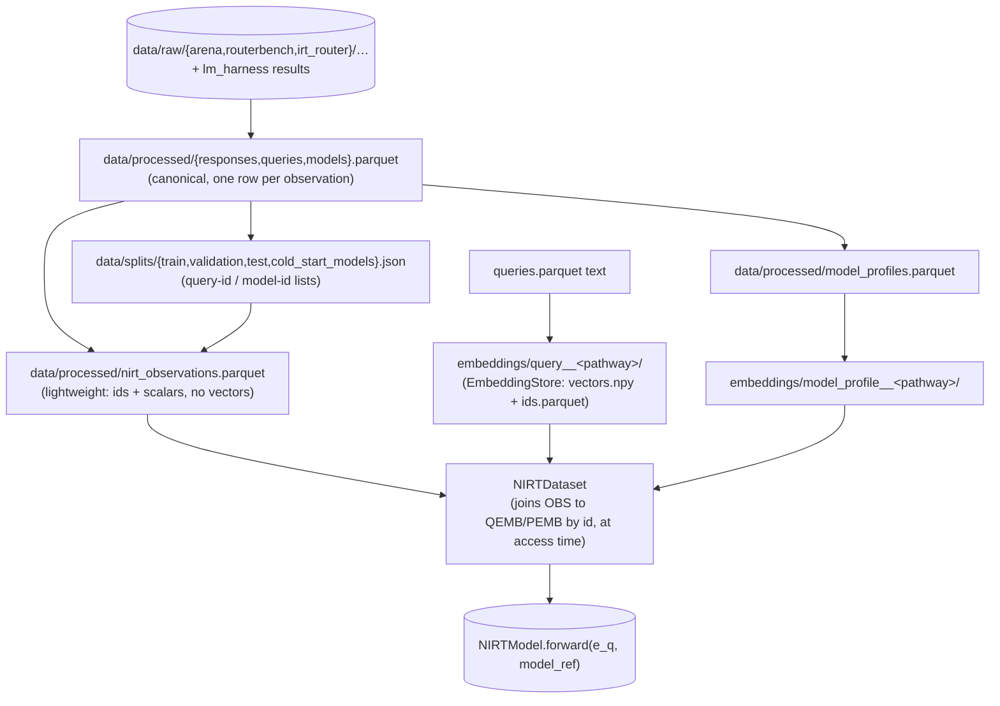

# Data structures & loading

How data is shaped and read, end to end: the `Config` object every script
starts from, the canonical processed tables, the splits, the NIRT observation
table, and the facade class that ties them together. This is the *schema and
loading-API* reference — for the *process* view (which script builds which
file, and why) see [workflows.md](workflows.md); for the embedding-pathway /
profile / taxonomy design rationale in depth, see
[query_and_model_representation.md](query_and_model_representation.md); for
chance correction / pairwise-preference handling / the model-id registry, see
[data_sources.md](data_sources.md). This doc only duplicates enough of those
to keep the loading story self-contained.

---

## 1. The big picture



Two layers, deliberately: `nirt_observations.parquet` is pure scalars (ids +
target + a few reference columns, ~10 MB for hundreds of thousands of rows);
the 768-d embedding vectors live in separate memory-mapped `EmbeddingStore`s
and are joined **by id at access time**, never copied into the observation
table. This is why adding a new embedding pathway never requires rebuilding
`nirt_observations.parquet`.

---

## 2. `Config` — how every script gets its settings

[`src/router/config.py`](../src/router/config.py). `Config` is a read-only,
attribute-accessible wrapper over one parsed YAML file.

```python
from router.config import load_config

cfg = load_config()                       # defaults to configs/phase0.yaml
cfg = load_config("configs/nirt.yaml")    # or an explicit path

cfg.embedding.default_pathway             # attribute access into nested dict
cfg.get("model.dim", 1)                   # dotted-path lookup with a default
cfg.path("processed")                     # -> <repo_root>/data/processed  (paths.processed, resolved)
cfg.resolve("some/relative/path")         # resolve an arbitrary relative path the same way
cfg.to_dict()                             # raw nested dict
```

`REPO_ROOT` is two parents up from `config.py` (the actual repo root); every
relative path in a config — under `paths:` or anywhere else — resolves
against it, so scripts run correctly regardless of the caller's cwd.

### The config files (`configs/*.yaml`)

| file | governs |
|---|---|
| `phase0.yaml` | the master data-pipeline config: `paths`, `sources` (raw locations + E3 model list), `multiple_choice` (n_choices lookup), `chance_correction`, `embedding` (pathways), `profiles`, `clustering`/`taxonomy`/`labeling`, `anchor_judge`, `retrieval`/`split` |
| `phase1.yaml` | Phase 1 plain Bernoulli/BCE `BaselineNIRT`: `data.pathway`, `response`, `model`, `ablation`, `regularization`, `train`, `retrieval`, `evaluation` |
| `phase2.yaml` | Phase 2 continuous-response ablation on the same representation: `response_models` (bernoulli/normal/beta/zoib) |
| `nirt.yaml` | the current NIRT model: `data` (pathway, `query_pathway` override, `query_features`, `score_kind`), `model` (orientation, dim, capacity knobs, collapse diagnostics), `train` (loss, sampler, routing-aware loss options), `classical_irt`, `knn_impute`, `routing`, `evaluation`, `baselines`, `runs_dir` |
| `irt_router.yaml` | the isolated IRT-Router-paper replication track — its own `paths`, `sources.irt_router` (repo/commit, 20-model pool, id/ood datasets), `multiple_choice`/`chance_correction`/`embedding`/`profiles`/`split` |
| `model_registry.yaml` | canonical model-id registry: `models[]`, each with `canonical_id`, `provider`, `family`, `version`, `aliases` (native string + `high`/`medium`/`low` confidence) — see [data_sources.md §3](data_sources.md#3-canonical-model-registry) |
| `model_profiles.yaml` | human-curated LLM profile text: `profiles.<model_id>` → `feature` sentence + optional `params_b`/`context_window`/`release`/prices |
| `model_prices.yaml` | `prices.<model_id>` → USD-per-1M-token input/output prices, used by `training.data.pricing.fill_costs` for sources (mainly local E3 lm-harness models) whose raw data has no native cost column |

---

## 3. Raw sources (`data/raw/`)

| source | script | landing path | shape |
|---|---|---|---|
| RouterBench | `download_routerbench.py` | `data/raw/routerbench/{routerbench_0shot,5shot,raw}.pkl` | wide pickled DataFrame: `sample_id, prompt, eval_name`, per-model score columns, `<model>\|model_response`, `<model>\|total_cost`, `oracle_model_to_route_to` |
| Chatbot Arena | `download_arena.py` | `data/raw/arena/arena-human-preference-55k/` (HF `datasets` disk format) | `id, model_a, model_b, prompt, response_a, response_b, winner_model_a, winner_model_b, winner_tie` — no timestamps/language tags in this release |
| GPT-4 Judge | `download_arena.py` | `data/raw/arena/gpt4_judge_battles/` | same battle schema, LLM-judged instead of human |
| IRT-Router | `download_irt_router.py` | `data/raw/irt_router/{data/{train,test1,test2}.csv, utils/map/*.csv, utils/bert_embeddings/*.pkl, utils/relevance/*.pkl, utils/cold/*.pkl}` | per-(query,model) rows with precomputed `performance`/`cost`, plus the paper's own 768-d BERT embeddings and 25-d relevance vectors |
| lm-evaluation-harness | `run_lm_harness.py` | `sources.lm_harness.results_dir/<model>/**/*samples*.jsonl` | per-sample logs for pool-expansion (E3) models RouterBench never scored |

Nothing downstream reads these directly except `build_response_matrix.py` —
every other script reads the canonical processed tables (§4).

---

## 4. Canonical processed tables (`data/processed/`)

Built by `scripts/data/build_response_matrix.py` (see
[workflows.md §1](workflows.md#1-data-ingestion--canonical-tables) for the
call chain; [data_sources.md](data_sources.md) for the chance-correction and
pairwise-preference *policy* these tables encode).

### `responses.parquet` — one row per observation

`RESPONSE_COLUMNS` (from `training/data/schemas.py`) plus the chance-correction
and content-hash columns added by `build_tables`:

```
query_id, model_id, query, score, metric_type, dataset, split, source,
is_multiple_choice, n_choices, input_tokens, output_tokens, latency, cost,
metadata,
corrected_score, chance_level, chance_corrected,   # added by apply_chance_correction
content_hash                                        # added in build_tables
```

`score` is never overwritten — `corrected_score` is `NA` wherever no
correction applied (non-MC, or MC with unknown `n_choices`). `metadata` carries
per-source extras: `origin` (train/test1/test2 for IRT-Router),
`native_model_name`, and for pairwise rows, `opponent_model_id`/`role`/`pair_id`
(one row per side of a battle — see
[data_sources.md §2](data_sources.md#2-pairwise-preference-sources-arena--gpt-4-judge)).

### `queries.parquet`

```
query_id, query, dataset, source, content_hash, n_observations, n_models,
cluster_id,   # NA until scripts/taxonomy/cluster_queries.py runs
metadata
```

### `models.parquet`

```
model_id, model_name, provider, family, version, profile_text,
source_datasets, n_observations, sources, metadata
```

`profile_text` starts empty here — it's filled in separately by
`model_profiles.parquet` (§7), not this table.

---

## 5. Splits (`data/splits/*.json`)

Built by `scripts/data/build_splits.py` (`src/training/data/splits.py`).

**Granularity**: per **content-hash group**, not per row — queries sharing
normalized text (e.g. a RouterBench 0-shot/5-shot pair) are hashed together
via `router.data.normalize.content_hash` and always land in the same split as
one unit. Models get a *separate* cold-start lottery
(`split.cold_start_model_fraction`, stratified per source, honoring
`force_warm`/`force_cold`) — a cold-start model's observations appear in
**none** of train/val/test, only in `cold_start_models.json`.

**Assignment**: deterministic SHA-256 hash of `f"{seed}:{content_hash}"` into
`[0, 1)`, bucketed against `train_fraction`/`validation_fraction` — no RNG
state, so re-running with the same seed reproduces the same split exactly.
`splits.check_leakage` asserts zero query-id intersection across
train/validation/test/ood and raises if it finds any.

**File shape**: each `data/splits/<name>.json` is
`{"query_ids": [...], "params": {...}}` (or, for `cold_start_models.json`,
`{"model_ids": [...], "warm_model_ids": [...], "params": {...}}`).

**Alternate mode** (`split.presplit: true`, used by `configs/irt_router.yaml`):
`make_presplit` honors the source's own partition
(`metadata["origin"] ∈ {train, test1, test2}`) instead of hashing — `train` →
train+validation (split by content hash), `test1` → test, `test2` → an
additional `data/splits/ood.json`; every model stays warm.

---

## 6. The NIRT observation table (`nirt_observations.parquet`)

Built by `scripts/data/build_nirt_dataset.py` →
`training.data.nirt.build_nirt_observations`. `NIRT_OBS_COLUMNS`:

```
query_id, model_id, target, score_raw, metric_type, source, split, cost,
is_multiple_choice, n_choices
```

| column | meaning |
|---|---|
| `query_id`, `model_id` | canonical join keys |
| `target` | the `score_kind`-selected supervision value (default `"effective"` = chance-corrected where MC, else raw; `"raw"` and `"corrected"` also selectable) |
| `score_raw` | original unmodified score, always present |
| `metric_type` | one of the correctness types: `accuracy`, `mc_accuracy`, `exact_match`, `f1`, `pass@1`, `acc`, `acc_norm` |
| `source` | `routerbench` / `lm_eval_harness` / etc. |
| `split` | joined from `data/splits/*.json`; rows whose query is in no split are dropped by default |
| `cost`, `is_multiple_choice`, `n_choices` | reference/diagnostic columns, carried through from `responses.parquet` |

**Not included**: pairwise preference (Arena/Judge) — opponent-dependent, so it
doesn't slot into a `[query × model]` absolute matrix; use
`TrainingData.pairwise(...)` instead. Cold-start models are excluded
(`models="warm"` by default).

This table carries **no embeddings** — that's the whole point of the
two-layer design in §1; `NIRTDataset` (§8) joins vectors in at access time.

---

## 7. `TrainingData` — the loading facade

[`src/training/data/facade.py`](../src/training/data/facade.py). A
`@dataclass` holding the loaded tables (`cfg, responses, queries, models,
splits, profiles`), with lazy accessors for everything derived from them:

```python
from router.config import load_config
from training.data.facade import load_training_data

d = load_training_data(load_config())    # reads responses/queries/models.parquet + splits + (if present) model_profiles.parquet
```

| method | reads | returns |
|---|---|---|
| `d.model_ids()` / `d.warm_model_ids()` / `d.cold_start_model_ids()` | `responses["model_id"]`, `splits["cold_start_models"]` | list of ids |
| `d.split_query_ids(split)` / `d.query_texts(split)` | `splits[split]`, `queries.parquet` | ids / `{query_id: text}` |
| `d.correctness(split, metrics, models, score_kind)` | `responses.parquet`, filtered to correctness metric types | long-form DataFrame with `score_effective` added |
| `d.correctness_matrix(...)` | same, pivoted | `R[query_id, model_id]` DataFrame via `router.nirt.frames.pivot_qm` |
| `d.n_choices(split)` | `responses.parquet` | `{query_id: n_choices}` |
| `d.pairwise(source, split, models)` | `responses.parquet`, pairwise metric types | reconstructed battle rows: `model_a, model_b, winner, score_a, pair_id` |
| `d.model_profiles()` / `d.profile_text(model_id, column)` | `model_profiles.parquet` | DataFrame / str |
| `d.query_embeddings(pathway)` / `d.profile_embeddings(pathway)` / `d.profile_embedding(model_id, pathway)` | `EmbeddingStore` under `embedding.cache_dir` | `EmbeddingStore` / vector |
| `d.query_features(name)` | `query_features__<name>/` `EmbeddingStore` | `EmbeddingStore` |
| `d.nirt_observations(**build_kw)` | `nirt_observations.parquet` if present (else builds it on the fly) | DataFrame |
| `d.nirt_dataset(split, pathway, query_pathway, query_features, **kw)` | the above + embedding stores | `NIRTDataset` (§8) |
| `d.summary()` | everything above | a counts dict, for a quick sanity print |

`load_training_data(cfg)` itself: reads `responses.parquet` (via
`read_responses`), `queries.parquet`, `models.parquet` from
`cfg.path("processed")`, loads splits via `load_splits(cfg)` (**raises** if any
split file is missing), and loads `model_profiles.parquet` only if it exists
(profiles are optional).

---

## 8. Embedding stores and `NIRTDataset` (brief — full depth in [query_and_model_representation.md](query_and_model_representation.md))

An `EmbeddingStore` (`src/router/embeddings/encoder.py`) is `id -> vector`,
persisted as `vectors.npy` (float32, memory-mapped) + `ids.parquet`
(`<id_field> -> row`) + `manifest.json` (backend/model/pooling/dim/
`config_fingerprint`/`complete`), under
`<embedding.cache_dir>/<kind>__<pathway>/` where `kind ∈ {query,
model_profile, query_features}`. Query stores embed `queries.parquet["query"]`
(the raw prompt text); profile stores embed a model's `profile_text` — a
natural-language *description* of the LLM, not any query text — so both live
in one text space and a cold-start model can be placed from its description
alone.

`NIRTDataset` (`src/router/data/nirt.py`) joins `nirt_observations.parquet`
to two `EmbeddingStore`s by id, lazily:

```python
ds = d.nirt_dataset(split="train", pathway="irt")
ds[0]
# {"query_embedding": float32[768], "model_embedding": float32[768],
#  "target": float32, "metric": "mc_accuracy", "source": "routerbench", "cost": nan}
```

`pathway` sets both stores; `query_pathway` overrides **only** the query-side
store (e.g. a kNN-imputed representation, `knn10w`) while the profile store
stays on `pathway`. `query_features` names a `query_features__<name>` store
whose vector gets concatenated onto `query_embedding` (increasing
`query_dim`); a query missing from that store falls back to zeros rather than
erroring.

---

## 9. Query features (`query_features__<name>/`)

Built by `scripts/embeddings/build_query_features.py` /
`src/training/data/query_features.py` — a small, leakage-free, purely
structural feature vector per query (no labels): a one-hot of the coarse
benchmark family (fixed order from `profiles.task_families`), `is_5shot`
(from the `query_id` suffix), normalized `prompt_len`/`prompt_words`, and
normalized `n_choices` (0 for free-form). Saved as an ordinary `EmbeddingStore`
so `NIRTDataset` joins it the same way it joins the raw text embedding.

---

## 10. Model profiles (`model_profiles.parquet`)

Built by `scripts/models/build_model_profiles.py` /
`src/training/models/profiles.py`. `PROFILE_COLUMNS`:

```
model_id, model_name, provider, family, version, has_curated, feature,
profile_text, profile_version, n_observations, n_datasets,
structured,   # JSON: params_b, context_window, release, modality, prices, provider, family, version
empirical     # JSON: overall_correctness, correctness_by_family, mc_skill_above_chance, mean_cost, pairwise win_rate/n per source
```

`profile_text` (curated description + optional empirical addendum) is the
default embedding input for the profile `EmbeddingStore` (§8); `feature`
(curated-only) is available for description-only embeddings
(`profiles.include_empirical: false`). `configs/model_prices.yaml` fills in
`cost` on raw observations (via `training.data.pricing.fill_costs`, applied in
`build_response_matrix.py`) for sources whose native data has no cost column —
mainly the local E3 lm-harness models; RouterBench's own `total_cost` is left
untouched.

A **separate**, currently-thin `LLMProfile` dataclass
(`src/router/llm/profile.py`: `name, provider, model_id, version,
input_cost_per_token, output_cost_per_token, context_window, capabilities`)
exists for a live-serving model registry — distinct from this training-side
parquet/YAML pipeline; don't conflate the two (see the note in
[architecture.md](architecture.md#notes) about the analogous `LLMClient`
name collision).

---

## 11. Anchor-judge side dataset (`data/processed/anchor_judge/`)

A separate small dataset for testing Arena/Judge-vs-correctness alignment
(see [workflows.md §6](workflows.md#6-anchor-judge-data-collection-and-analysis)
for the pipeline and [anchor_judge.md](anchor_judge.md) for the decision
rule). Layout:

```
anchor_judge/
├── anchor_selection.json       # {pool, ranked list, anchor_model_id}  — the median-accuracy model
├── sampled_queries.parquet     # index=query_id, stratum ∈ {discriminative, natural}
├── sampled_queries_summary.json
├── judgments.parquet           # query_id, anchor_model_id, candidate_model_id, gain,
│                                #   anchor_is_a, reason, raw, parsed_ok,
│                                #   judge_provider, judge_model, swapped
├── collection_summary.json
└── anchor_judge_analysis.json  # final verdict: TWO UTILITIES / DOMAIN SHIFT / INCONCLUSIVE / VOID
```

All configured under `configs/phase0.yaml`'s `anchor_judge` block; no new
queries are collected — this reuses RouterBench query ids and response text.

---

## 12. Quick-reference cookbook

```python
from router.config import load_config
from training.data.facade import load_training_data

cfg = load_config()                                   # configs/phase0.yaml
d = load_training_data(cfg)

d.summary()                                            # sanity-check counts
R = d.correctness_matrix(metric="accuracy", models="warm")   # [query x model]
ds = d.nirt_dataset(split="train", pathway="irt")      # NIRTDataset for training

qs = d.query_embeddings("irt")                         # EmbeddingStore
qs.get("some_query_id")                                # -> np.ndarray[768]

d.profile_text("gpt-4-1106-preview")                   # curated + empirical description
d.profile_embedding("claude-2.0", "irt")               # cold-start model vector

from router.nirt.checkpoint import load_run
model, run_cfg, model_index = load_run("nirt-2d-projected")   # a trained checkpoint
```
