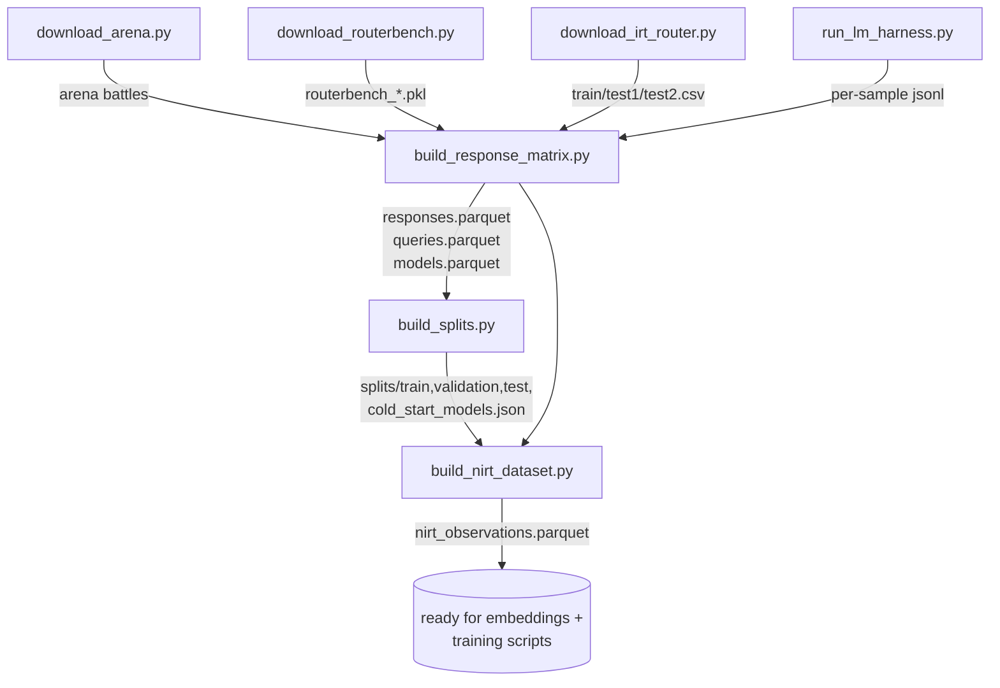
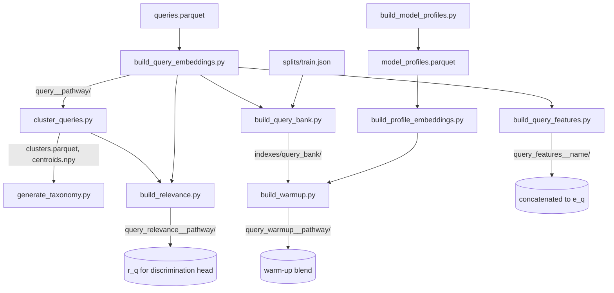
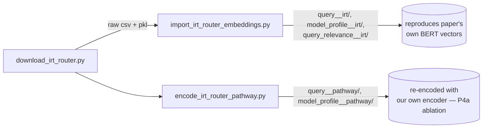
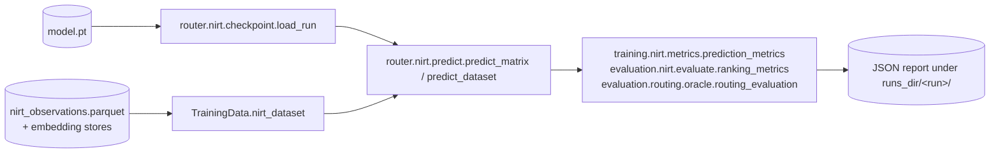
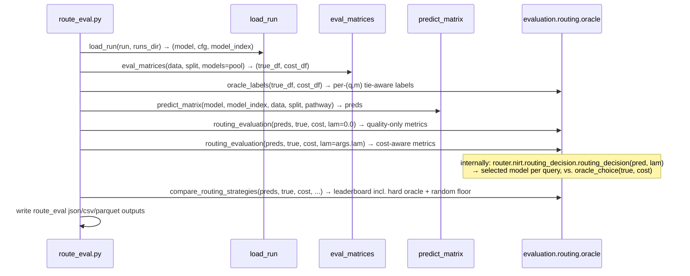
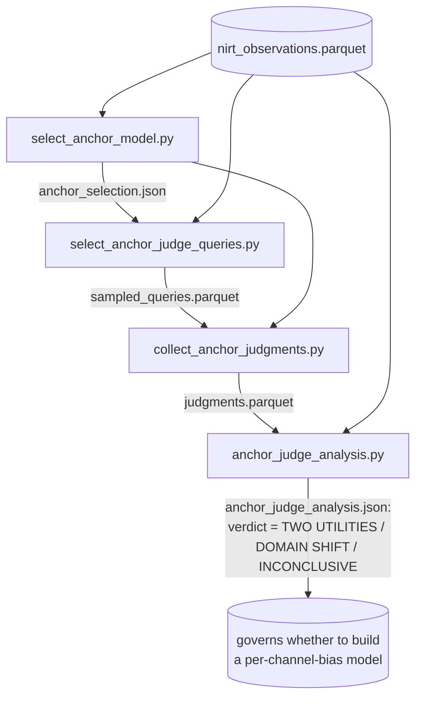
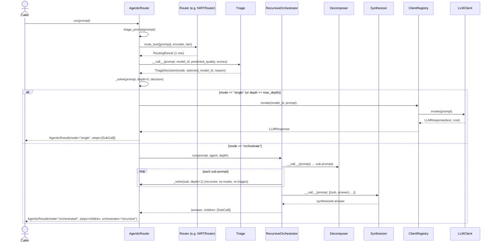

# Workflows

Every runnable pipeline in this repo, as a diagram: which classes/functions get
called, in what order, what each step reads and writes, and why the step
exists. This is the *process* view — "what happens when I run this script."
For the *data* view ("what shape is this file, how do I load it") see
[data_structures.md](data_structures.md). For the class hierarchies these
workflows are built from, see [architecture.md](architecture.md).

Conventions used below: `module.Class.method` names a real call site (verified
against source, not inferred from filenames); "Output" lists the file(s)
written and their format; "Why" is pulled from the code's own docstrings/
comments, not invented.

---

## 1. Data ingestion → canonical tables

Turns three raw benchmark sources into one normalized `(query_id, model_id,
score, ...)` table, then assigns leakage-free splits, then narrows to the
lightweight join table every NIRT script reads.



| step | calls | output | why |
|---|---|---|---|
| `download_arena.py` | `datasets.load_dataset(sources.arena.hf_repo)` → `Dataset.save_to_disk` | `data/raw/arena/...` (HF disk format: id, model_a/b, prompt, response_a/b, winner_*) | raw pairwise-preference source |
| `download_routerbench.py` | `git clone` (fallback: `datasets.load_dataset(...).save_to_disk`) | `data/raw/routerbench/{routerbench_0shot,5shot,raw}.pkl` | canonical RouterBench correctness source; loader needs the `.pkl` form specifically |
| `download_irt_router.py` | raw `urllib.request` per file in `FILES` | `data/raw/irt_router/{data/*.csv, utils/...}` + `PROVENANCE.txt` | source data for the isolated IRT-Router replication track (§3) |
| `run_lm_harness.py` | builds and (`--execute`) runs `lm_eval` CLI commands | `sources.lm_harness.results_dir/<model>/**/*samples*.jsonl` | fills in RouterBench-style per-item scores for pool-expansion (E3) models RouterBench never ran |
| `build_response_matrix.py` | `training.data.response_matrix.build_tables(cfg, sources)` → `loaders.load_all` (per-source loaders + `model_registry.canonical_model_id`, `normalize.make_query_id`) → `schemas.coerce_response_frame` → `chance_correction.apply_chance_correction` → `pricing.fill_costs` → `quality.check_responses` (raises on failure) → `write_tables` | `data/processed/{responses,queries,models}.parquet` | single canonical normalized layer; every later script reads this, never the raw sources directly |
| `build_splits.py` | `response_matrix.read_responses` → `splits.make_splits` (or `make_presplit`) → `splits.check_leakage` (raises on overlap) → `splits.write_splits` | `data/splits/{train,validation,test,cold_start_models}.json` | deterministic (SHA-256 hash bucket, not RNG state), leakage-checked query/model partition every downstream script trusts without re-deriving |
| `build_nirt_dataset.py` | `training.data.nirt.build_nirt_observations` (→ `TrainingData.correctness`, joins split + cost/source) → `write_nirt_observations`; sanity build of `NIRTDataset.from_config` unless `--no-check` | `data/processed/nirt_observations.parquet` | the join key every NIRT training/eval script consumes; deliberately carries no embeddings so it's pathway-agnostic |

See [data_sources.md](data_sources.md) for the chance-correction formula,
pairwise-preference handling, and cross-source model-id merge policy that
`build_response_matrix.py` applies — this doc only traces the call chain.

---

## 2. Embeddings, taxonomy, and retrieval bank

Everything between the canonical tables and the NIRT model's input tensors:
encode text, cluster it, derive a relevance signal, and build a train-only
nearest-neighbor index. All of it is a pure function of query/profile text +
split — no labels — so it's leakage-free by construction.



| step | calls | output | why |
|---|---|---|---|
| `build_model_profiles.py` | `training.models.profiles.build_model_profiles` (curated YAML + `empirical_stats` from `responses.parquet` + `render_profile_text`) → `write_model_profiles` | `data/processed/model_profiles.parquet` | text source for profile embeddings; lets a cold-start model be placed from its description alone |
| `build_query_embeddings.py` | `load_encoder(cfg, pathway)` → `router.embeddings.build_store(out_dir, ids, texts, encoder, id_field="query_id", resume=True)` | `<cache_dir>/query__<pathway>/{vectors.npy, ids.parquet, manifest.json}` | frozen `e_q` — the core NIRT input feature; streaming + resumable so an interrupted encode doesn't restart from zero |
| `build_profile_embeddings.py` | same `build_store`, `id_field="model_id"`, text = `profile_text` (or `feature`) | `<cache_dir>/model_profile__<pathway>/...` | initializes `theta_m` from description text (`projected` mode) |
| `build_query_features.py` | `training.data.query_features.build_query_features` (family one-hot + `is_5shot` + prompt length/word-count + n_choices) | `<cache_dir>/query_features__<name>/...` | fixes the RouterBench 0-/5-shot confound; concatenated onto `e_q` in `NIRTDataset` |
| `cluster_queries.py` | `training.taxonomy.clustering.build_clusters` (UMAP → HDBSCAN → unit-norm centroids in original space) → `write_clusters` | `data/taxonomy/{clusters.parquet, centroids.npy, clustering.json}` | ability-cluster assignment that `r_q` and the taxonomy labels are both derived from |
| `generate_taxonomy.py` | `training.taxonomy.taxonomy.build_taxonomy` (TF-IDF top terms + family purity per cluster, no LLM) | `data/taxonomy/taxonomy.json` | human-readable cluster labels for inspection; not consumed numerically downstream |
| `build_relevance.py` | `training.taxonomy.relevance.build_relevance` = `relevance_from_embeddings(e_q, centroids, tau)` → softmax over cosine-to-centroid | `<cache_dir>/query_relevance__<pathway>/...` (rows sum to 1) | conditions the discrimination head; a pure function of frozen embedding + centroids, so it's computable for unseen queries too |
| `build_query_bank.py` | `training.retrieval.query_bank.build_query_bank` — restricts to `train`-split ids, builds `faiss.IndexFlatIP`/`IndexFlatL2`, wraps `QueryBank`, `.save()` | `data/indexes/query_bank/{index.faiss, ids.parquet, manifest.json}` | train-only kNN index; backbone of the kNN-imputed-query variant and the warm-up build — built once, never rebuilt during training |
| `build_warmup.py` | `training.retrieval.warmup.build_warmup_representations` = `QueryBank.search` → average neighbor vectors in model-pathway space | `<cache_dir>/query_warmup__<pathway>/...` | precomputed Phase-1 warm-up blend (`e_q' = (1-α)e_q + α·neighbor_mean`), joined by id like `r_q` |

See [query_and_model_representation.md](query_and_model_representation.md) for
the full pathway/profile/taxonomy design rationale (this doc only traces the
call chain and file dependencies).

### 2a. IRT-Router parallel data track

An isolated pipeline (own `configs/irt_router.yaml`) that reproduces the
IRT-Router paper's 20-LLM × 12-dataset benchmark instead of building on
RouterBench.



`import_irt_router_embeddings.py` rekeys the paper's own precomputed BERT
embeddings and relevance vectors onto our `query_id`/`model_id` (via
`make_query_id`/`canonical_model_id`) and saves them as ordinary
`EmbeddingStore`s — so the rest of the pipeline (`pathway="irt"`) runs
unchanged. `encode_irt_router_pathway.py` is the alternative: re-encode the
same query/profile text with one of *our* encoder pathways, to test whether
our encoders beat the paper's frozen BERT vectors on the identical item set.

---

## 3. NIRT model training

The central workflow — trains the bilinear IRT-style correctness predictor
(`NIRTModel` or `IRTRouterModel`, selected by `model.orientation`).

```mermaid
sequenceDiagram
    participant CLI as train_nirt.py
    participant Facade as TrainingData
    participant DS as NIRTDataset
    participant Build as build_model()
    participant Fit as training.nirt.train.fit
    participant Model as NIRTModel / IRTRouterModel

    CLI->>Facade: load_training_data(phase0_cfg)
    CLI->>Fit: fit(cfg, phase0_cfg, datasets?, name)
    Fit->>Facade: nirt_dataset(split="train", pathway, query_pathway, query_features)
    Facade->>DS: NIRTDataset.from_config(...)
    Fit->>Facade: nirt_dataset(split="validation", ...)
    Fit->>DS: gather() → dense (Q, M, y) arrays
    Fit->>Build: build_model(model_cfg, n_models, query_dim, profile_dim)
    Build->>Model: NIRTModel.from_config(model_cfg) [or IRTRouterModel]
    loop each epoch
        Fit->>Model: model(e_q_batch, model_ref_batch)
        Fit->>Fit: loss_fn(logit, target) [soft_bce / hard_bce / mse / pairwise / listwise]
        Fit->>Model: backward(); opt.step()
        Fit->>Model: predict on validation → prediction_metrics(...)
        Fit->>Fit: _collapse_diagnostics(theta_q) [effective rank, argmax agreement]
    end
    Fit->>Fit: early stop on val_metric; restore best state_dict
    Fit-->>CLI: run_result (val_metrics, baselines, history)
    CLI->>CLI: torch.save({state_dict, config, model_index, dims}, model.pt)
    CLI->>CLI: write run.json (history, baselines, git sha)
```

| step | calls | output | why |
|---|---|---|---|
| load data | `training.data.facade.load_training_data(p0)`, `TrainingData.nirt_dataset(split, pathway, query_pathway, query_features)` → `router.data.nirt.NIRTDataset` | in-memory dataset | joins `nirt_observations.parquet` to the two `EmbeddingStore`s by id |
| build model | `router.nirt.model.build_model(model_cfg, n_models, query_dim, profile_dim)` → dispatches on `orientation` to `NIRTModel.from_config` (ours, `query_latent`) or `IRTRouterModel.from_config` (paper, `model_latent`) | in-memory `nn.Module` | one function keeps the trainer orientation-agnostic — both share `forward(e_q, model_ref)` |
| optional pairwise loss | `training.nirt.pairwise.build_pairwise_arrays` (only if `train.preference.enabled`) | in-memory arrays | auxiliary Bradley-Terry term on Arena/Judge battles (see [anchor_judge.md](anchor_judge.md) for why this was later re-examined) |
| train loop | `torch.optim.Adam` (+ optional scheduler); per epoch: forward, loss, backward, `training.nirt.metrics.prediction_metrics` on validation, `_collapse_diagnostics` | in-memory `history` list | per-epoch collapse diagnostics catch the "model ignores the query" failure mode (`theta_q` effective rank collapsing to 1) early, optionally aborting |
| checkpoint | `torch.save({state_dict, config, n_models, model_index, query_dim, profile_dim}, model.pt)` | `<runs_dir>/<name>/model.pt` | the one artifact every eval/diagnostic script below loads via `router.nirt.checkpoint.load_run` |
| run log | `training.cli.write_json` | `<runs_dir>/<name>/run.json` | full training history + baselines + git sha for reproducibility |

**Baseline variants** — `scripts/nirt/baseline/train_baseline.py` (Phase 1,
frozen plain Bernoulli/BCE `BaselineNIRT`) and `train_continuous.py` (Phase 2,
swaps in a Normal/Beta/ZOIB `ResponseHead` on the same architecture) follow the
identical shape but call `training.nirt.baseline.train.fit` instead, writing
to `artifacts/phase{1,2}/.../{model.pt, config.yaml, metrics.json,
training_history.json, provenance.json}`. See
[baseline_control_arm.md](baseline_control_arm.md) and
[nirt_model.md](nirt_model.md) for why the two architectures coexist.

---

## 4. Prediction-quality evaluation and diagnostics

`eval_nirt.py` is the label-aware quality check; everything else in
`scripts/nirt/` is a variation that answers one specific research question
about *why* a run predicts the way it does. They all share the same plumbing:



| script | unique question it answers | distinctive call | output |
|---|---|---|---|
| `eval_nirt.py` | how well does this checkpoint predict, on this split? | `evaluation.nirt.evaluate.evaluate_split` | `eval_<split>.json` (bce/auc + marginal baselines) |
| `ab_orientation.py` | does `query_latent` (ours) or `model_latent` (paper) win, head-to-head? | trains **both** orientations via `training.nirt.train.fit`, plus `evaluation.baselines.classical_irt.fit_classical_irt` as a transductive ceiling | `_ab_orientation_<split>.json` |
| `complexity_search.py` | is underfitting fixable by adding capacity (wider K, deeper query head, vector difficulty, interaction residual)? | random search over `training.nirt.train.fit` configs on the kNN-imputed representation | `complexity_search.json` (per-config test BCE/AUC/regret + train→test gap) |
| `knn_impute_sweep.py` | what's the best k for the kNN-imputed query representation, and does it hold up OOD? | `training.retrieval.knn_impute.build_knn_imputed_store` per k, `evaluation.nirt.ood.ood_datasets/ood_matrices` | `knn_impute_sweep.json` (ID + OOD rows per k) |
| `coldstart.py` | can a `projected` run place a held-out LLM using only its profile text? | `evaluation.nirt.evaluate.cold_start_eval` (asserts `free` mode raises, since it structurally can't) | `coldstart_<split>.json` |
| `capacity_diagnostics.py` | *where* does the underfitting come from — bilinear form, frozen representation, or genuinely-hard families? | classical-IRT ceiling + `training.trainers.mlp_router.fit_mlp_router` (IRT-free bound) + per-family breakdown via `evaluation.nirt.ood.family_of_query` | `capacity_diagnostics.json` |
| `shrinkage_eval.py` | does blending toward `model_mean`, weighted by embedding novelty, fix OOD calibration? | `router.nirt.shrinkage.novelty_weight` / `shrink_predictions` swept over a midpoint | `shrinkage_eval.json` |
| `theta_collapse.py` | has `theta_q` degenerated into ignoring the query entirely? | effective-rank eigendecomposition of `theta_q` covariance vs. argmax agreement with a constant | `theta_collapse_<split>.json` |
| `train_test_gap.py` | is this run overfitting or underfitting? | train/val/test BCE/Brier/AUC gap, restricted to 0-shot for comparability | stdout table only |
| `misroute_analysis.py` | *why*, specifically, does the router pick the wrong model on regretful queries? | pure pandas aggregation over `route_eval.py`'s pre-written per-query/per-model CSVs — no model reload | `misroute_<split>.json` |
| `compare.py` | how good is this run, fully — prediction + ranking + routing + AIQ, against every baseline family? | classical-IRT + kNN-router + MLP-router baselines, `evaluation.nirt.routing.routing_report`/`pareto`/`aiq` | `comparison_<label>.json` |

`training.nirt.train.fit` is the only function in this family that actually
trains (`train_nirt.py`, `ab_orientation.py`, `complexity_search.py`,
`knn_impute_sweep.py`); every other script only loads an existing checkpoint
via `router.nirt.checkpoint.load_run`.

**Baseline-arm evaluation** (Phase 1/2, separate module family
`training.nirt.baseline`): `evaluate.py` dispatches on response-model type to
`training.nirt.baseline.eval.evaluate_checkpoint` (Bernoulli: accuracy/BCE/AUC/
ECE/cold-start/theta-spectrum/ICC) or `continuous_eval.evaluate_continuous`
(Normal/Beta/ZOIB: NLL/MAE/RMSE/coverage/boundary calibration).
`compare_response_models.py` runs all four response heads side by side — the
decision artifact behind selecting ZOIB (see
[phase2-continuous-response memory](../memory/phase2-continuous-response.md)).
`boundary_stats.py` reports the 0/1/interior mass split that motivated trying
a zero-one-inflated head in the first place. `inspect_baseline.py` is a
stdout-only interpretability tool (no file written) for reading off a
specific model's `theta_m` or a specific query's `a_q`/`b_q`.
`synthetic.py` is a correctness gate: generates data from the model's own
generative assumptions and checks `BaselineNIRT` recovers the ground truth
parameters — independent of real-data noise.

---

## 5. Routing evaluation

Where "is the prediction good" (§4) turns into "does this produce good
*routing decisions*." All three scripts below score raw prediction matrices
directly — none of them instantiate a `Router` object; that class exists for
live serving (§7), not for these batch comparisons.



| step | calls | output | why |
|---|---|---|---|
| `route_eval.py` | see diagram; optionally also scores a ZOIB/Bernoulli checkpoint matrix and an `oracle_classifier_matrix` baseline | `route_eval_<split>.json`, `..._per_query.csv`, `oracle_labels_<split>.parquet` | separates calibration quality from routing quality — a model can win NLL and lose regret |
| `route_compare.py` | `evaluation.nirt.routing.train_quality` (best-fixed-model reference) → `checkpoint_matrix`+`align` per policy (NIRT, IRT-Router paper, Bernoulli, ZOIB E[Y], ZOIB LCB) → `routing_report` → `add_reward_columns` → `pareto` → `aiq` | stdout tables, `artifacts/{phase2,irt_router}/routing_comparison.json` | leaderboard across *policies*, not just one model — includes the λ-sweep cost/quality frontier (AIQ) |
| `scripts/pool_expansion/run_phase.py` | `evaluation.pool_expansion.run_battery` — an entire fixed battery (pool description → prediction quality → routing block → cold-start → ablation → shot breakdown → provenance) | `artifacts/pool_expansion/<phase>/*.json`, appends `ledger.json`, regenerates [pool_expansion_results.md](pool_expansion_results.md) | every time a candidate model is added to the pool, re-runs the *identical* battery so phases stay apples-to-apples in one ledger, with the predictor frozen |

See [routing_evaluation.md](routing_evaluation.md) for the oracle-label
tie-breaking rules and metric definitions, and
[pool_expansion.md](pool_expansion.md) for the battery's rationale.

---

## 6. Anchor-judge data collection and analysis

A side workflow testing whether Arena/Judge-style pairwise preference reflects
the same notion of "quality" as RouterBench correctness, using an LLM judge
over *existing* RouterBench queries (no new queries collected).



| step | calls | output | why |
|---|---|---|---|
| `select_anchor_model.py` | `evaluation.nirt.routing.train_quality(ROUTERBENCH_11, metric="accuracy")` → picks the **median**-accuracy model | `anchor_selection.json` | anchoring on the strongest model would floor the measurable gain |
| `select_anchor_judge_queries.py` | `TrainingData.correctness_matrix` → `zeroshot_only` → `evaluation.data.stratify.sample_stratified_queries` (discriminative vs. natural strata) | `sampled_queries.parquet`, `sampled_queries_summary.json` | a stratified sample, not a random one, so both "models clearly differ" and "models look similar" queries are represented |
| `collect_anchor_judgments.py` | Phase A: `evaluation.judge.client.JudgeClient.judge` per (query, candidate) with deterministic A/B position swap; Phase B: ~10% re-judge for a noise floor | `judgments.parquet`, `collection_summary.json` | gated behind `--confirm-budget` + a real API key — the one workflow in this repo that spends money per run |
| `anchor_judge_analysis.py` | `evaluation.routing.oracle.routing_evaluation` repeatedly (gain-matrix regret/disagreement against gold correctness, at noise-floor and per-stratum) vs. a random baseline | `anchor_judge_analysis.json` | resolves whether the Bradley-Terry auxiliary loss in `train_nirt.py` (§3) measured genuine conflicting-utility signal or just OOD domain shift |

See [anchor_judge.md](anchor_judge.md) for the full pre-registered decision
rule this analysis applies.

---

## 7. Agentic serving flow

Not a script — a library call chain triggered by user code calling
`AgenticRouter(...).run(prompt)`. This is the only workflow in this doc that
runs against a **live prompt** rather than a fixed benchmark split.



| step | calls | output | why |
|---|---|---|---|
| route | `AgenticRouter.route_decision` → `Router.route_text` (base class; internally `predict_scores_text` then `router.nirt.routing_decision.routing_decision`) | `RoutingResult` (1 row) | needs the router to score raw text with no prebuilt `query_id` — only `NIRTRouter`/`KNNRouter` implement this (`can_route_text=True`) |
| triage | `HeuristicTriage.__call__` (default; quality threshold + lexical multi-part check) or `LLMTriage.__call__` | `TriageDecision(mode, selected_model_id, reason)` | decides single-shot vs. decompose from the router's *own* predicted-quality signal, not a separate classifier |
| single branch | `AgenticRouter._answer_directly` → `ClientRegistry.invoke` → `LLMClient.invoke` | `SubCall(mode="single")` | the routed model is predicted to handle the whole prompt |
| orchestrate branch | `RecursiveOrchestrator.run` → `NaiveDecomposer`/`LLMDecomposer` → recursive `AgenticRouter._solve` per sub-prompt → `concat_synthesizer`/`LLMSynthesizer` | `SubCall(mode="orchestrated", children=[...])` | splits a compound request so each part can be routed to a model strong enough for it |
| recursion floor | `_solve` forces the single-answer path once `depth >= max_depth` (default 2) regardless of triage verdict | — | bounds how deep decomposition can nest |
| alternative orchestrator | `AgenticRouter.with_langchain_orchestrator(llm)` swaps in `LangChainToolOrchestrator`, which exposes `route_query`/`answer_with_model`/`route_and_answer` as LangChain tools and lets a tool-calling agent decide the decomposition itself (`route_and_answer` re-enters `_solve`, so recursion still applies) | same `(answer, [SubCall])` contract | lets an LLM drive the decomposition instead of the fixed decompose→solve→synthesize control flow, without changing `run`/`_solve` |

Final `AgenticResult` carries `mode`, `answer`, `triage_reason`,
`selected_model_id`, `predicted_quality`, `steps` (the top-level `SubCall`
list), `orchestrator` name, and total `cost` (summed via `SubCall.walk()`
over the whole recursion tree). See [agentic_router.md](agentic_router.md) for
the triage heuristic's exact thresholds and the client/orchestrator options.
